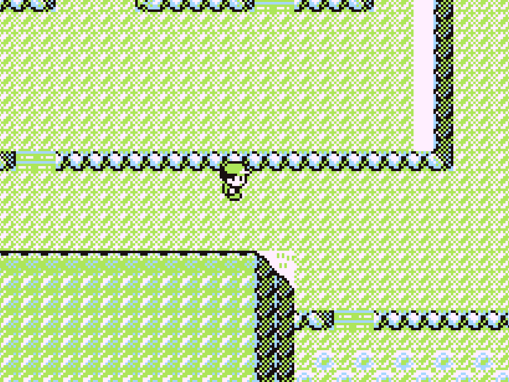
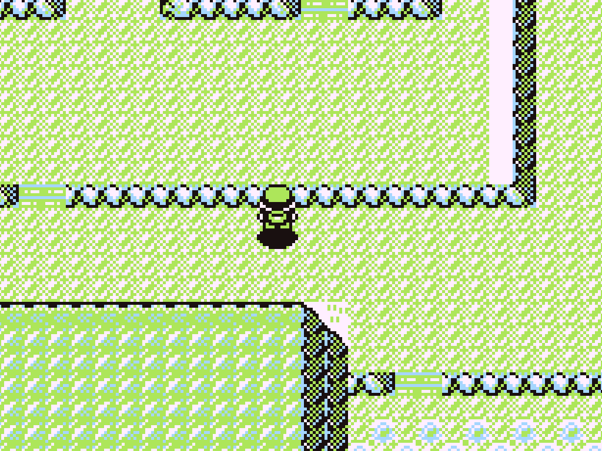
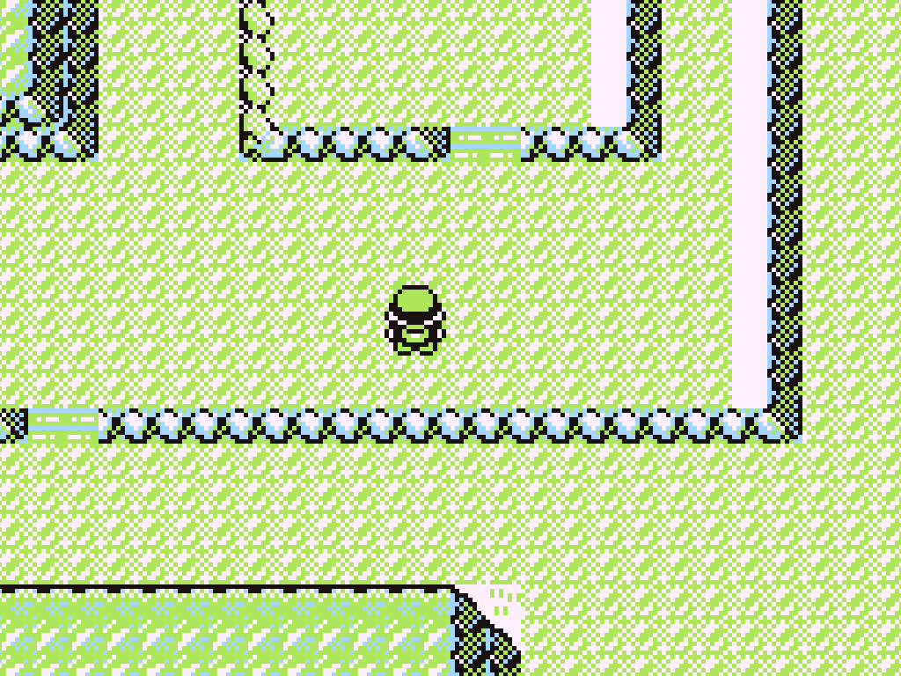
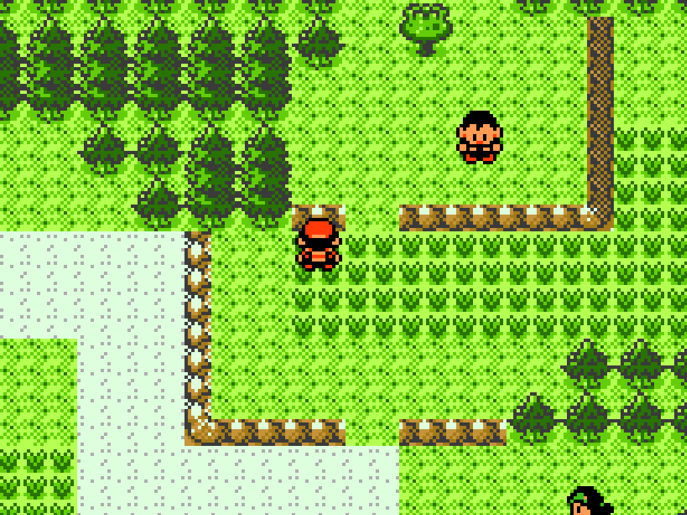
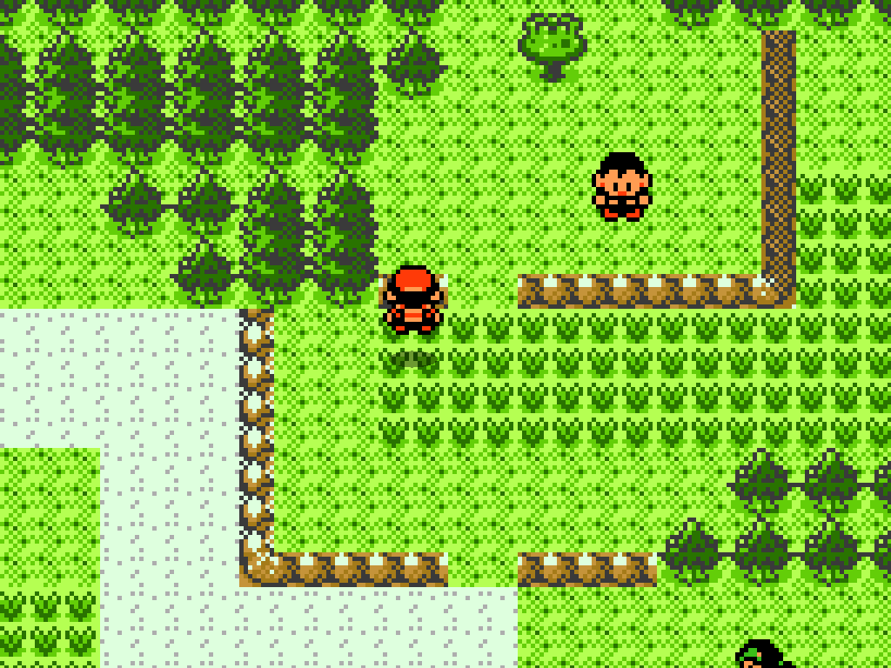
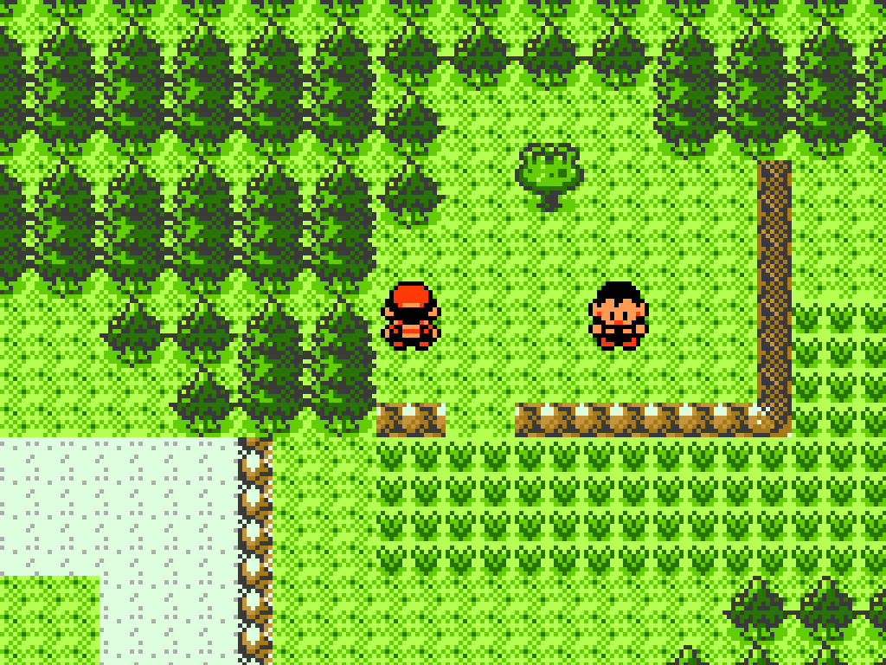

# Run Forrest

A movement mod for [Gen1Recomp](https://github.com/alamops/gen1recomp). Hold **B**
and two things happen:

- **You run.** A tile takes half as long on foot — bike speed, the Gen 3+
  Running Shoes figure.
- **You can climb ledges.** Every one-way hop in Kanto and Johto becomes
  two-way while B is held. Drop off a ledge, change your mind, hold B and
  press back into it.

Works on Red, Blue, Yellow and Gold. Works offline; it is a movement feature,
not a connection feature.

---

## The jump

Every frame below is a real capture from a live run — the game, the real map
data, the mod loaded through the real loader. Nothing is staged or drawn.

### Red — pressing UP into a south ledge, B held

<table>
<tr>
<td width="33%"></td>
<td width="33%"></td>
<td width="33%"></td>
</tr>
<tr>
<td align="center"><sub><b>1.</b> below the ledge</sub></td>
<td align="center"><sub><b>2.</b> mid-air, hop shadow beneath</sub></td>
<td align="center"><sub><b>3.</b> on top</sub></td>
</tr>
</table>

Route 4 at (40,10) → (40,8). That landing cell is where the engine's *own*
ledge test takes off from when it hops down, so this is the exact inverse of
behaviour the engine already vouches for.

### Gold — pressing UP into a `HOP_DOWN` ledge, B held

<table>
<tr>
<td width="33%"></td>
<td width="33%"></td>
<td width="33%"></td>
</tr>
<tr>
<td align="center"><sub><b>1.</b> below the ledge</sub></td>
<td align="center"><sub><b>2.</b> mid-air</sub></td>
<td align="center"><sub><b>3.</b> on the ledge tile</sub></td>
</tr>
</table>

Route 29 at (10,6) → (10,4), collision `0xa3`. Landing *on* the ledge tile is
the point rather than a near miss: from there the next press hops straight
back down through Gold's own untouched `.TryJump`.

**The mid-air frame is the one worth looking at.** That arc and that shadow
are not this mod's — they are each generation's own ledge-hop animation, which
the climb reuses rather than re-invents. It looks like the drop played
backwards because that is exactly what it is.

---

## The part that is new

Running has been done before. Climbing has not, and it is the reason this mod
exists.

Both generations ship the same one-way shortcut and neither ships the way back.
You drop off a ledge outside Mt. Moon, realise the item you wanted was on the
plateau, and walk the long way round. This mod gives you the short way back —
but only while you are asking for it. Let go of B and every ledge in the game is
exactly the one-way shortcut its designers drew.

### Which ledges

All of them, in the direction they came from:

| the ledge | vanilla | Run Forrest, with B held |
| --- | --- | --- |
| a south ledge | press **DOWN** to drop | press **UP** to climb |
| a west ledge | press **LEFT** to drop | press **RIGHT** to climb |
| an east ledge | press **RIGHT** to drop | press **LEFT** to climb |

A mountain-wall face is not a ledge and never becomes one. Neither is a cell you
could simply have walked into — if the gap in front of you is open ground, you
walk it, because a two-cell jump across open ground is a teleport, not a climb.

### On the bike

Yes. B is the gate on foot and on the bike alike, which is the one rule worth
having: a cyclist is not running, and still wants the way back.

This cannot collide with Cycling Road's held-B brake. The brake is the branch
the engine takes when **no** direction is held; a climb needs one held. The two
can never be asked for by the same frame of input.

### Not while surfing

Neither game has a ledge on the water, and a hop off it would land you on foot
in the sea.

---

## Options

Both rows live under **START → OPTIONS**, both default on.

| row | what turning it off does |
| --- | --- |
| `B TO RUN` | B stops changing your pace. Climbing still works. |
| `B TO CLIMB` | Ledges go back to one-way. Running still works. |

They are separate on purpose. B already means "cancel" everywhere else in these
games, so a player surprised by either half should be able to keep the half they
wanted.

---

## Install

Drop the folder into your Gen1Recomp `mods/` directory as `rby_run_forrest`, or
install it from the launcher's mod panel. It is enabled per game — the Red /
Blue / Yellow / Gold checkboxes in the launcher are independent.

```
mods/
  rby_run_forrest/
    manifest.json
    main.lua
    src/
```

---

## How it works

Two seams, and no engine file is patched out.

**Running** wraps `movement.speed`, which both engines raise once per committed
step. The arithmetic is a *divisor*, not a frame count: the engine hands over
this game's walk speed and the mod halves whatever it was handed, so a data pack
that says a tile is 24 frames gets a 12-frame run rather than being quietly
slowed to the vanilla 8. The bike and surfing pass through untouched.

**Climbing** is decided on `input.step`, the logic tick both engines raise
*before* the pad's edges are promoted and before the overworld reads the d-pad.
A climb started there has the player already moving by the time the engine looks
at input, so the engine's own `if player.moving then return end` stands down of
its own accord. Nothing is suppressed and no vanilla path is replaced; the frame
simply already has a move in it.

The geometry is one rule for both generations:

```
a hop starts on cell A, passes over cell B, lands on cell C
  ==> the climb starts on C, passes over B, lands on A
```

What differs is where each game writes the ledge down. Gen 1 marks **B**, the
cliff face between, and names it in a `data.field.ledges` row alongside the tile
you jump from. Gold marks **A**, the far side: its ledge tile is walkable land
you stand on to jump off, and the cell between is the wall that makes it
one-way. So the Gen 1 arm reads the cell one ahead and the Gold arm reads the
cell two ahead — and both then ask the same two questions: is the gap refused,
and is the landing free.

Landing *on* Gold's ledge tile is the point rather than an accident: the next
press hops straight back down, which is exactly the two-way seam this is for.

Each generation's climb is then executed by mirroring that generation's own
forward hop — Gen 1 queues the two script steps and sets the cosmetic arc, Gold
writes the two-cell target directly — so there is never a second notion of "a
hop" in the tree for the follower, the camera and the save to disagree about.

---

## Tests

The headless suite runs against an engine checkout with no ROM:

```sh
cd /path/to/gen1recomp
ln -s /path/to/RBYRunForrest mods/rby_run_forrest
luajit mods/rby_run_forrest/tests/rby_run_forrest_test.lua
```

It drives the real loader on both generations, asserts the two seams and two
options rows are actually installed, drives the registered `movement.speed`
closure directly, and unit-tests both reverse-hop arms against fixture maps.

The live driver proves the feature in a real game, on real Route 4 tile data.
Its three positive cases are the exact inverses of the three control cases in
the engine's own `tests/drivers/route4_ledge_bug223_test.lua`, so every cell it
asserts is a cell the engine's ledge test already vouches for:

```sh
POKEPORT_DRIVER=mods/rby_run_forrest/tests/drivers/route4_climb_test.lua \
POKEPORT_IDENTITY=runforrest POKEPORT_TOUCH=0 love .
```

---

## Releases

`.github/workflows/release.yml` cuts an installable release on every push to
`main` that touches something other than docs or the workflow itself. It packs
the mod, publishes a GitHub Release, and attaches the `.zip` plus a
`sha256sums.txt`.

The version is resolved by the first rule that applies:

1. the `version` input of a manual **Run workflow** dispatch,
2. `[release X.Y.Z]` anywhere in the commit message,
3. `manifest.json`'s own version, when it is ahead of every existing tag —
   **this is the normal way to cut a release**, so bumping the manifest is the
   whole ritual,
4. otherwise the newest `vX.Y.Z` tag with its patch incremented.

Whichever wins is written into the `manifest.json` *inside* the archive, so an
installed mod never reports a different version than the release it came from.
A run refuses rather than overwrites if the tag or release already exists.

**What a player receives** is the same set of files `modkit pack` produces, because
the workflow reads `.modkitignore` rather than keeping a second list that could
drift from it: the mod itself, the README and the changelog. The test suite and
the two e2e drivers are excluded — they require an engine checkout and are
unrunnable from an archive — and so are this README's screenshots, which are
composited from tiles and sprites decoded from the player's own ROM and belong
on a GitHub page rather than in a distributed `.zip`.

There is no test job in CI, and that is deliberate rather than an omission: the
suite runs against a `gen1recomp` checkout (`luajit mods/rby_run_forrest/tests/...`)
and the drivers need LÖVE plus a ROM, none of which a standalone mod repo has.
Run them locally, as above, before pushing a version bump.

---

## Known limitation

**Yellow's Pikachu does not hop with you.** The follower recognises a ledge by
matching the same row the forward hop matches, in the forward direction, inside
a local the mod cannot reach. On a climb it does not recognise one, so instead
of arcing after you it walks up to the cell you took off from and follows a step
later. It self-corrects on the next step and never gets stuck; it just does not
look as good as the drop does.

## Licence

Same as the engine it mods.
